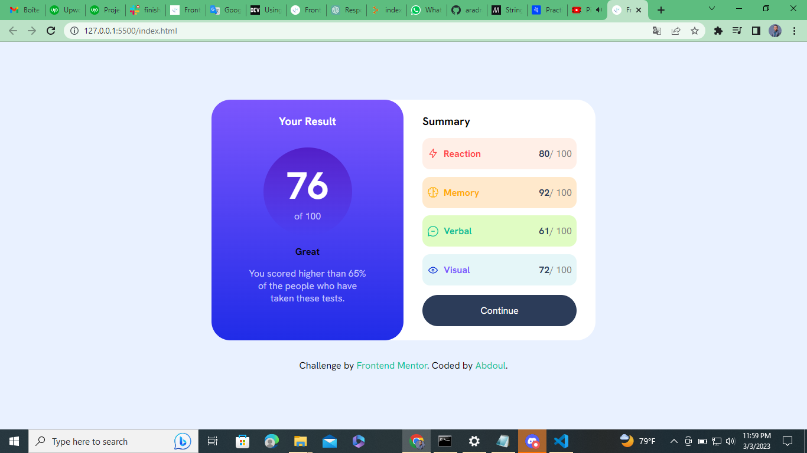

## Overview

- # Project Name: Gamer High Score Search App
  The Gamer High Score Search App is a web application that allows users to search for high score of the best gamers in the world and display a summary of search results. This project includes a result summary component that displays key information about each search result.

  # Installation
  To install the Gamer score Search App and its dependencies, follow these steps:

Clone the repository using git clone https://github.com/aradradev/gamer-result-summary.git
Navigate to the project directory using `cd gamer-result-summary/`
Install the dependencies using `code .`

### The challenge

Users should be able to:

- View the optimal layout for the interface depending on their device's screen size
- See hover and focus states for all interactive elements on the page

### Screenshot

### Links

- Solution URL: (https://github.com/aradradev/gamer-result-summary.git)
- Live Site URL: (https://gamer-result-summary.vercel.app/)

### Built with

- Semantic HTML5 markup
- CSS custom properties
- Flexbox
- CSS Grid
- Mobile-first workflow

## Author

- Website - [Abdourahmane Diallo](https://www.facebook.com/abdourahamane.jalloh.5)
- Frontend Mentor - [@aradradev](https://www.frontendmentor.io/profile/aradradev)
- Twitter - [@Abdoul_2023](https://twitter.com/Abdoul_2023)

